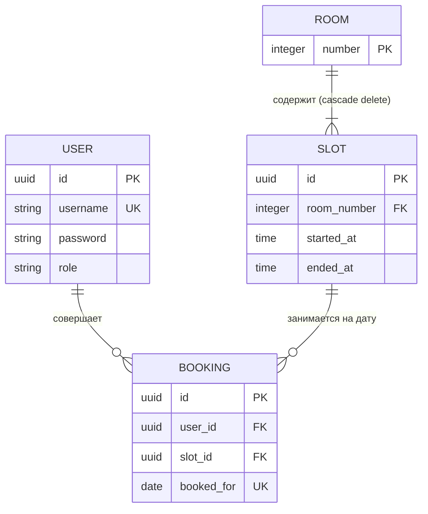

# 🏢 Переговорки || Сервис Бронирования Коворкинга

---

### Предварительные требования

- [Python 3.13+](https://python.org)
- [Poetry 2.0+](https://python-poetry.org)
- [Docker & Docker Compose](https://docker.com)
- [Git](https://git-scm.com)

### Установка и запуск

1. Клонирование репозитория

```bash
git clone https://github.com
```

2. Переход в папку проекта

```bash
cd koworking
```

3. Инициализация и активация виртуального окружения (Poetry)

```bash
poetry shell
```

4. Установка зависимостей

Для запуска проекта локально

```bash
poetry install --only main
```

5. Настройка переменных окружения

Windows (PowerShell)

```powershell
Copy-Item .env.example .env
```

Linux/macOS

```bash
cp .env.example .env
```

6. Быстрый продакшн-запуск всего окружения (Docker)

```bash
docker compose up --build -d
```
*При первом старте lifespan-скрипт автоматически создаст таблицы в базе данных и заполнит расписание комнат (101 и 102) дефолтными временными слотами.*

---

После запуска сервер будет доступен по адресу:

- Документация Swagger UI: http://127.0.0
- Системный openapi.json: http://127.0.0

---

#### Функционал системы

**1. Аутентификация и роли**
Пользователь проходит регистрацию (`POST /auth/register`) с выбором роли (`employee` / `admin`). Авторизация возвращает JWT Bearer-токен (`POST /token`).

**2. Сетка свободных комнат**
Пользователь передает дату (`POST /booking/free`), а сервис выводит список комнат и только их **свободные** временные слоты. Занятые встречи автоматически скрываются.

**3. Бронирование переговорных**
Сотрудник выбирает конкретную дату и `slot_id` для бронирования. Действует жесткая защита от наложения встреч (Double Booking) на уровне базы данных.

**4. Управление историей встреч**
Сотрудники коворкинга могут просматривать свою историю встреч (`GET /user/my/bookings`). 
- Доступны функции отмены (удаления) брони (`POST /booking/delete_booking`).
- **Изоляция прав**: Сотрудник может удалять только свои брони, Администратор (`admin`) — любые.
- Администраторы могут просматривать полную историю встреч любого UUID-пользователя (`POST /user/user_info`) и менять роли (`POST /user/set_role`).

---

#### Установка зависимостей для разработки и тестов

Для разработки, тестов и линтинга кодовой базы

```bash
poetry install
```

---

#### Запуск проверок и тестов

Проверка линтером flake8

```bash
poetry run flake8 web/
```

Проверка форматирования black

```bash
poetry run black --check web/
```

Запуск асинхронных интеграционных тестов (Pytest)
Тесты изолированы и запускаются на асинхронной СУБД SQLite в памяти (`aiosqlite`), не затрагивая ваш рабочий PostgreSQL.

*Локально из терминала:*
```bash
poetry run pytest web/tests/ -v
```

*Внутри активного Docker-контейнера:*
```bash
docker exec -it koworking-web-1 pytest web/tests/ -v
```

---

###### Разработчик

Max Chernov